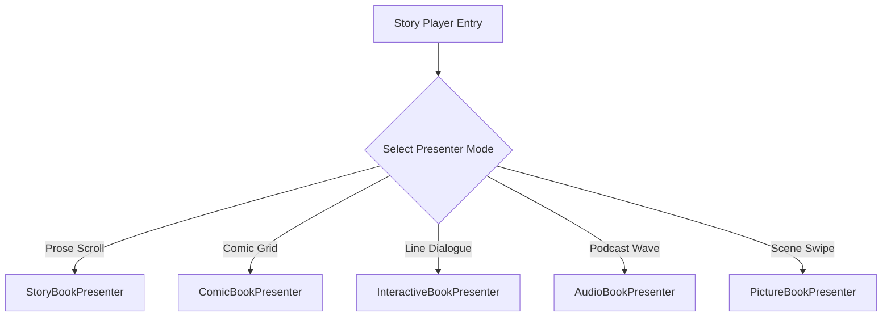

# LearnCI Web Portal Redesign Plan

This document outlines the architectural and visual redesign plan for **LearnCI-web**. The goal is to bring the web application to parity with the features of the native iOS and Flutter clients, introducing premium interactive learner features, data-centric administration workspaces, robust user account management, search engine optimization (SEO), and high-conversion calls to action (CTAs).

---

## 1. Design System & Aesthetics (Premium Dark Glassmorphism)

The web portal will transition to a **Premium Dark Mode** heavily inspired by **Glassmorphism** to match the native client experiences.

### Visual Pillars
*   **Deep Canvas Backgrounds:** Deep navy/charcoal (`#161925`) scaffolds with subtle diagonal gradients (`#0D1B2A` to `#1B263B`) to provide depth.
*   **Neon & Fire Accents:** Glowing Gold/Fire (`#FFA000`) for primary interactive states, active navigation rails, and primary CTAs. Neon Teal (`#00E5FF`) for secondary badges, completed items, and vocabulary tags.
*   **Glassmorphic Containers:** Semi-transparent cards (`backdrop-blur-md bg-white/5 border-white/10`) layered over the deep canvas. Interactive elements will brighten their border opacities on hover and tap.
*   **Typography Hierarchy:** 
    *   **Outfit** (Google Font): Primary display headings and hero sections (bold, geometric, modern).
    *   **Lexend** (Google Font): Uppercase section labels, progress trackers, tags, and micro-copy with wide letter-spacing (`tracking-wider`).
    *   **Inter** (Google Font): Legible, high-contrast, neutral font used for body prose, dialogue bubbles, and flashcard text.
*   **Micro-Animations:** Fluid hover scalings (`scale-[1.02]`), glowing drop shadows, smooth page transitions, and slide-ins for media presenters.

---

## 2. Phase 0: Visual Mockup & Interactive Prototype (Google Stitch Integration)

To establish a visual benchmark and prove the interactivity of the proposed redesign before core coding begins, this phase leverages **Google Stitch** (Google's AI-native UI/UX design and prototyping platform at `stitch.withgoogle.com`) to bridge early design concepts and functional front-end code.

### A. Google Stitch Prototyping Workflow
*   **Text-to-UI Design Canvas:** The design tokens, layout parameters, and glassmorphic aesthetics defined in this plan are fed directly into Google Stitch to generate coherent, multi-screen user flows (Auth, Dashboard, Players) instantly.
*   **AI-Native Conversational Iteration:** Design details like border-radius values, backdrop filters, and typography hierarchies are refined inside the Stitch canvas using iterative prompts.
*   **Direct React/Tailwind Code Export:** The finalized Stitch layouts are exported as clean, responsive HTML, CSS, and Tailwind React components, accelerating the setup of the Next.js page directories.

### B. High-Fidelity UI Mockup
A premium dark-mode, glassmorphic dashboard mockup has been generated. It visualizes the weekly streak cards, progress rings, and active story catalogs in the deep navy-charcoal canvas with glowing neon backlights.
*   **Asset Location:** `design/portal_dashboard_mockup.png` (within the web project folder).

### C. Interactive HTML/CSS/JS Prototype
A single-file, zero-dependency interactive prototype has been built to test layout flows, simulated Whisper karaoke audio synchronization, vocabulary click glossary popups, and 3D SRS flashcard flipping.
*   **File Location:** [prototype.html](file:///Users/alanglass/_dev/LearnCompInput/LearnCI-web/design/prototype.html) (within the web project folder).
*   **Usage:** Open the file directly in any modern web browser to interact with the responsive layout and components.

---

## 3. Core Learner Experience Overhaul

### 📖 A. Interactive Story Player (Multi-Presenter Engine)
The web story reader will be upgraded to a dynamic multi-presenter engine that reads the `StoryLayout` JSON structure from the Supabase database.



1.  **The Chapter Intro Header:** 
    *   Render the AI-generated `chapterIntroText` (thematic quotes and location/character orientation paragraphs) at the top of each chapter.
    *   Styled in italicized, muted text (`opacity-60`) with a thin glass divider separator.
2.  **Whisper Karaoke Text Highlighting (`StoryBookPresenter`):**
    *   Parse the Whisper-generated `WordTiming[]` JSON array.
    *   Synchronize the text cursor with the HTML5 audio timeline. As the audio plays, the active word highlights in glowing gold.
    *   Implement **Under-Highlighting** (allowing the user to tap any word to instantly jump the audio playback to that specific word's timestamp).
3.  **Comic Book Grid Presenter (`ComicBookPresenter`):**
    *   Implement a responsive CSS Grid parser that reads the `PanelLayout` coordinates (`col_span`, `row_span`, `crop_region`) from `layout_json` and `readingMatterPagesJson`.
    *   Render high-fidelity AI-generated comic panels in a visual storyboard with narrative dialogue overlays.
4.  **Dialogue & Speech Bubbles (`InteractiveBookPresenter`):**
    *   Render character conversations as left/right conversational speech bubbles.
    *   High-contrast white bubble backgrounds, black text, and character names highlighted in Lexend bold gold badges above each bubble.
5.  **Translation Toggles & Vocabulary Lookups:**
    *   A floating translation slider allowing users to toggle the display between the Target Language, Parallel English, or Dual-Language side-by-side mode.
    *   **Clickable Vocabulary:** Clicking any word in a story pops open a card showing its definition, part of speech, and an "Add to Flashcards" button.

---

### 🎴 B. Vocabulary Flashcards & SRS Engine
Introduce a dedicated vocabulary study center on the web that hooks into the learner's vocabulary collection and virtual decks.

*   **Glassmorphic Flip Cards:** High-fidelity 3D card flips using CSS 3D transforms. Front shows target word; back shows definition, example sentences, and audio pronunciation buttons.
*   **Spaced Repetition System (SRS) Inputs:** Hotkeys or buttons (Again, Hard, Good, Easy) that update card review intervals in the database.
*   **Virtual Deck Filters:** A sidebar utilizing Lexend typography labels allowing users to filter their active study decks by target stories or linguistic tags.

---

### 🎙️ C. Podcast Player (`PodcastShow` & `PodcastEpisode` Support)
Integrate a premium podcast player to support natural, conversational listening resources synced from Supabase.

*   **Podcast Hub:** A grid of `PodcastShow` cards displaying show art, descriptions, and episode counts.
*   **Persistent Audio Cockpit:** A floating audio dock at the bottom of the portal that persists across page transitions, maintaining playback rate controls ($0.8\text{x}$, $1.0\text{x}$, $1.2\text{x}$, $1.5\text{x}$) and play/pause state.
*   **Interactive Transcript View:** Similar to the story player, displays a scrollable parallel transcript that highlights lines in real-time as the hosts converse.

---

### 📺 D. Integrated YouTube Immersion Center (`/portal/watch`)
An upgraded version of the current YouTube player that turns passive watching into tracked comprehensible input.

*   **Curated Channel Catalog:** A curated gallery of educational and natural Comprehensible Input YouTube channels categorized by language and difficulty level.
*   **Focus Player:** An embedded iFrame player with distracted-free cinematic mode (dimming surrounding elements).
*   **Automated Progress Syncer:** Automatically monitors player state and logs active viewing minutes to the `user_activities` table in Supabase once the user reaches key thresholds.

---

## 4. User Accounts, Authentication & Profile Management

The authentication and user settings flows will be fully integrated into the new design system, providing a secure, cohesive experience from onboarding to account maintenance.

### 🔐 A. Onboarding & Authentication Engine
*   **Unified Auth Portal (`/login` & `/signup`):**
    *   Glassmorphic auth cards containing clean input fields styled with subtle white-opacity borders.
    *   Supports traditional Email/Password credentials and Google OAuth sign-in.
    *   Dynamic validation states using CSS `:user-valid` and `:user-invalid` selectors.
*   **Secure Password Recovery (`/reset-password`):**
    *   A secure, multi-step flow that allows users to request a password reset link and securely update their password via Supabase Auth integration.
    *   Clear feedback banners for password strength, mismatch alerts, and email transmission confirmations.

### ⚙️ B. Profile & Account Center (`/portal/profile`)
A dedicated dashboard for learners to configure their target metrics and personalize their learning environment.
*   **Language & Level Settings:**
    *   Drop-down selectors to update the active target language (Spanish, French, German, Italian, Portuguese, Mandarin).
    *   Adjust current comprehension level (A1 to C2) to dynamically filter story difficulty in the library.
*   **Personalization Controls:**
    *   Configure text-to-speech (TTS) voice genders, playback speeds, and narrative style preferences.
*   **Account Management:**
    *   Update email credentials, change passwords securely from within the active session, and view account creation metadata.

---

## 5. Administrative & Creator Console Overhaul (`/admin`)

The `/admin" route will be overhauled from a simple read-only dashboard into a data-centric developer, operator, and pipeline cockpit.

```
/admin (Dashboard Overview)
  ├── /admin/pipeline   (7-Phase Draft Creator Workspace)
  ├── /admin/stories    (Live Stories Table Manager)
  ├── /admin/functions  (Edge Function Status & Execution Cockpit)
  ├── /admin/database   (DB Schema Editor & Library Asset Manager)
  └── /admin/users      (User Activity Audits & Mindset Monitors)
```

### 🛠️ A. The Data-Centric 7-Phase Pipeline Workspace (`/admin/pipeline`)
A developer-focused control center for in-progress drafts in the `story_pipeline` table. For each of the 7 stages, the interface exposes complete data transparency and inline editing:

1.  **Direct Database & Table View:**
    *   A raw data viewer displaying the underlying row columns and metadata for the selected draft.
2.  **Interactive JSON Schema Editor:**
    *   Expose the raw, syntax-highlighted JSON data structures (e.g., `parameters_json`, `ci_profile_json`, `bible_json`, `treatment_json`, `scene_breakdown_json`, `layout_json`, `reading_matter_pages_json`, `post_production_json`).
    *   Allow direct, real-time editing of these JSON structures with built-in validation to prevent syntax errors.
3.  **GenAI Prompt & Engine Console:**
    *   **Prompt Transparency:** Displays the exact **System Prompts** and **User Prompts** sent to the Deno Edge Functions / OpenAI APIs to generate that specific phase.
    *   **Prompt Customization:** Allow operators to edit these prompts and parameters (e.g., system context, temperature, token limits) before triggering a stage regeneration.
    *   **History & Token Logs:** Track prompt iterations, token usage, and response latencies for audit purposes.
4.  **7-Phase Navigation:**
    *   *Phase 1 (Idea/Bible):* View/edit `parameters_json`, `ci_profile_json`, and `bible_json` structures.
    *   *Phase 2 (Script Builder):* View/edit chapter scripts, scenes, and treatment breakups.
    *   *Phase 3 (Art Forge):* Track generated asset structures, DALL-E image prompts, and image URLs.
    *   *Phase 4 (CI Optimizer):* View/edit pedagogical alignment details and complexity analysis JSONs.
    *   *Phase 5 (Layout Designer):* View/edit panel coordinates and layout structures.
    *   *Phase 6 (Post-Production):* View/edit audio voice setups, timing JSONs, and ambient music selections.
    *   *Phase 7 (Final Publish):* Re-verify final outputs and publish to the live database.

---

### 📚 B. Live Stories Database Cockpit (`/admin/stories`)
Admins require the exact same depth of data transparency and editing capabilities for published stories in the live `stories` table.

*   **Raw Story Row Viewer:** An administrative grid displaying all published stories with quick-action panels.
*   **JSON & Media Editors:**
    *   Expose and allow editing of the live story JSON fields (e.g., `chapters`, `layout_json`, `metadata`).
    *   Directly edit narrative text segments, parallel translations, and vocabulary keys.
    *   Manage media paths, with the ability to update Supabase storage paths for audio tracks, cover images, and background video loops.
*   **Prompt Heritage Tracking:**
    *   Displays the historical system/user prompts and engine configurations that were used to generate this live story.
    *   Provides a "Clone to Draft Pipeline" action, letting admins copy a live story back to the draft pipeline, adjust prompts or inputs, and regenerate segments.

---

### ⚡ C. Edge Function & AI Status Cockpit
A panel to monitor and invoke Supabase Edge Functions manually:
*   **Function Actions:** Manual triggers for `generate_story`, `generate_story_audio`, `generate_timings`, and `generate_story_video` with custom JSON payload fields.
*   **Status Monitors & Deno Logs:** Real-time indicator badges showing function status alongside embedded console log outputs.

---

## 6. SEO Strategy & High-Conversion Landing Page

To attract new learners organically and convert them into active app users, the public landing page (`/`) will undergo a marketing overhaul.

### SEO Implementation
*   **Descriptive Semantic Title Tags:** E.g., `LearnCI | Master Languages via Personalized AI Stories & Comprehensible Input`.
*   **Compelling Meta Descriptions:** Rich, keyword-targeted snippets focused on natural acquisition and AI-dramatized audio.
*   **Strict Heading Hierarchy:** A single `<h1>` in the hero container, followed by sequential `<h2>` features, and `<h3>` component callouts.
*   **Structured Schema Markup:** Embed JSON-LD structured data on the homepage to register the site as a `SoftwareApplication` with links to the iOS app store.

### High-Conversion CTA Engine
*   **The Dual-Funnel Hero:**
    *   **Primary CTA (Gold Glow):** "Start Learning in Your Browser" (routes to `/signup`).
    *   **App Store Badges:** Highly visible, stylized links directing mobile visitors to download the native iOS client.
*   **Scientific Validation Section:** A visual interactive section showing Stephen Krashen's Input Hypothesis formula ($i+1$) and how LearnCI maps AI story generation directly to the learner's vocabulary state.

---

## 7. Proposed Directory & Routing Structure

To support these changes, the Next.js `app/` directory will be structured as follows:

```
app/
├── (marketing)/
│   ├── page.tsx                  # High-converting SEO landing page
│   ├── how-it-works/             # Interactive Comprehensible Input science guide
│   └── pricing/                  # Subscription plans
├── auth/
│   ├── login/page.tsx            # Glassmorphic sign-in screen
│   ├── signup/page.tsx           # Glassmorphic sign-up screen
│   └── reset-password/page.tsx   # Secure password recovery screen
├── admin/
│   ├── layout.tsx                # Admin sidebar navigation
│   ├── page.tsx                  # Admin dashboard statistics
│   ├── pipeline/
│   │   ├── page.tsx              # Active story drafts & pipeline grid
│   │   └── [draftId]/page.tsx    # 7-phase data editor (JSON, prompts, tables)
│   ├── stories/
│   │   ├── page.tsx              # Live stories list
│   │   └── [storyId]/page.tsx    # Live story editor (JSON, cover paths, prompts)
│   ├── functions/
│   │   └── page.tsx              # Edge function orchestrator & console logs
│   └── users/
│       └── page.tsx              # User progress, feedback, and coaching reviews
├── portal/
│   ├── layout.tsx                # Glassmorphic user navigation & persistent player bar
│   ├── page.tsx                  # Learner dashboard (streak, milestone progress rings)
│   ├── profile/
│   │   └── page.tsx              # Account, level, language, & credential settings
│   ├── stories/
│   │   ├── page.tsx              # Story catalog (filterable by lang/level)
│   │   └── [id]/
│   │       └── page.tsx          # Multi-presenter player (Prose, Comic, Bubble)
│   ├── review/
│   │   └── page.tsx              # Vocabulary Flashcards SRS engine
│   ├── podcasts/
│   │   ├── page.tsx              # Podcast show directory
│   │   └── [showId]/page.tsx     # Episode browser & transcript player
│   └── watch/
│       ├── page.tsx              # Curated YouTube channel gallery
│       └── [videoId]/page.tsx    # Immersive focus video player (minute tracker)
```

---

## 8. Implementation Roadmap & TODO Checklist

This granular checklist is designed to guide any software engineer or agentic AI through the complete execution of the redesign.

### 👥 Phase 0: Design Mockup & Interactive Prototyping (Completed)
*   [x] **Integrate Google Stitch Workflows:** Setup design canvas guidelines in Google Stitch to map multi-screen user flows (Onboarding, Dashboard, Players) and verify React/Tailwind code export paths.
*   [x] **Generate High-Fidelity UI Mockup:** Visual representation of the premium dark-mode glassmorphic dashboard (streak statistics, progress rings, cover graphics, and navigation rails).
*   [x] **Develop Interactive HTML/CSS/JS Prototype:** Single-file browser prototype illustrating navigation tab switches, simulated Whisper karaoke highlighting, vocabulary click glossaries, and 3D SRS card flips.

### 👥 Phase 1: Design System & Styling Setup (Completed)
*   [x] **Update `tailwind.config.ts`:**
    *   Add custom HSL colors for Dark Background (`#161925`), Dark Surface (`#23283B`), Neon Teal (`#00E5FF`), Gold/Fire (`#FFA000`), and Royal Accent (`#3861FB`).
    *   Set up keyframe animations and utility classes for glassmorphic cards and glowing drop shadows.
*   [x] **Import Google Fonts in `app/layout.tsx`:**
    *   Configure imports for `Outfit`, `Lexend`, and `Inter`. Expose them as custom CSS variables (`font-heading`, `font-labels`, `font-sans`).
*   [x] **Update Global Styles (`app/globals.css`):**
    *   Configure core backdrop-filter utility defaults.
    *   Define primary gradient patterns for authentication backgrounds, image cover overlays, and presenter bottom-fades.

### [x] Phase 2: Public Landing Page, SEO & Auth Redesign
*   [x] **Rebuild Public Landing Page (`app/(marketing)/page.tsx`):** Constructed the premium dark-mode hero, embedded App Store / Play browser CTAs, and integrated SEO metadata.
*   [x] **Update Authentication Screen Layouts (`app/auth/`):** Overhauled `app/login/page.tsx`, `app/signup/page.tsx`, and the dual-mode `app/reset-password/page.tsx` into responsive glassmorphic cards with robust Supabase Auth controls.

### ⬜ Phase 3: Learner Dashboard & Settings
*   [ ] **Upgrade Portal Dashboard (`app/portal/page.tsx`):**
    *   Refactor styling into the dark glassmorphic theme.
    *   Refactor the input hours milestone progress rings (using Outfit and Lexend titles).
*   [ ] **Create Settings Portal (`app/portal/profile/page.tsx`):**
    *   Create profile selectors for target language, comprehension level, and TTS voice preferences.
    *   Hook form inputs directly to Supabase client updates targeting the `profiles` table.

### ⬜ Phase 4: Multimedia Presenters (Story, Podcast, YouTube)
*   [ ] **Build Persistent Audio Cockpit (`app/components/AudioCockpit.tsx`):**
    *   Create a floating dock that remains active across client-side router transitions.
    *   Integrate speed adjustments and play/pause controls linked to the active media context.
*   [ ] **Upgrade Story Detail Player (`app/portal/stories/[id]/page.tsx`):**
    *   *Chapter Intro Header:* Render `chapterIntroText` / `chapterIntroTextEnglish` with a thin glass separator.
    *   *Prose Mode (`StoryBookPresenter`):* Parse the `WordTiming[]` array and highlight matching words as the HTML5 player advances. Add click-listeners to words to trigger definitions and jump audio tracks.
    *   *Comic Mode (`ComicBookPresenter`):* Parse layout matrices from `layout_json` into a responsive CSS grid overlaying DALL-E scene assets.
    *   *Bubble Mode (`InteractiveBookPresenter`):* Render speech bubbles with contrast color boundaries.
*   [ ] **Implement Podcast Presenter (`app/portal/podcasts/`):**
    *   Build show grids and episode index lists.
    *   Connect active episode audio to the persistent audio cockpit and render scroll-highlighted transcription blocks.
*   [ ] **Refactor YouTube Immersion Hub (`app/portal/watch/`):**
    *   Replace standard page embeds with a curated channel grid.
    *   Ensure iFrame state updates reliably invoke the Supabase progress syncer to increment minutes on `user_activities`.

### 👥 Phase 5: Vocabulary Study & SRS Flashcards (In Progress)
*   [/] **Build Flashcard Flipping Panel (`app/portal/review/page.tsx`):**
    *   [x] Construct 3D CSS transform classes for a double-sided study card.
    *   [x] Implement SRS response triggers (Again, Hard, Good, Easy) adjusting database intervals.
    *   [ ] Add vocabulary filter panels driven by Lexend category chips.

### ⬜ Phase 6: Overhauled Administrative Control Center
*   [ ] **Upgrade Admin Dashboard Overview (`app/admin/page.tsx`):**
    *   Establish unified layout navigation bars to switch between drafts, live stories, functions, and users.
*   [ ] **Create 7-Phase Draft Workspace (`app/admin/pipeline/[draftId]/page.tsx`):**
    *   *Database Viewer:* Build a tabular view of the active `story_pipeline` row.
    *   *JSON Schema Editor:* Embed a syntax-highlighted editor (e.g., Monaco Editor or simple JSON parser) that validates and updates the draft's JSON columns.
    *   *Prompt Console:* Expose read/write blocks for System Prompts, User Prompts, and Edge Function variables.
*   [ ] **Create Live Stories Cockpit (`app/admin/stories/[storyId]/page.tsx`):**
    *   Build the story database grid with full search filters.
    *   Provide direct, real-time text/translation/JSON editors mapping to the live `stories` table.
    *   Provide a "Clone to Draft Pipeline" action.
*   [ ] **Build Edge Function Status Console (`app/admin/functions/page.tsx`):**
    *   Establish visual indicators for active Edge Functions.
    *   Create payload dispatchers and console log windows to debug remote runs.

### ⬜ Phase 7: Verification & Auditing
*   [ ] **E2E Testing:** Verify players, YouTube timers, and draft pipeline updates using Playwright test suites in `tests/`.
*   [ ] **SEO Validation:** Audit meta tags, headings, schema markup, and responsiveness.
*   [ ] **Performance Check:** Run Lighthouse builds to ensure high-efficiency rendering and fast page loads under the new glassmorphic styling.
