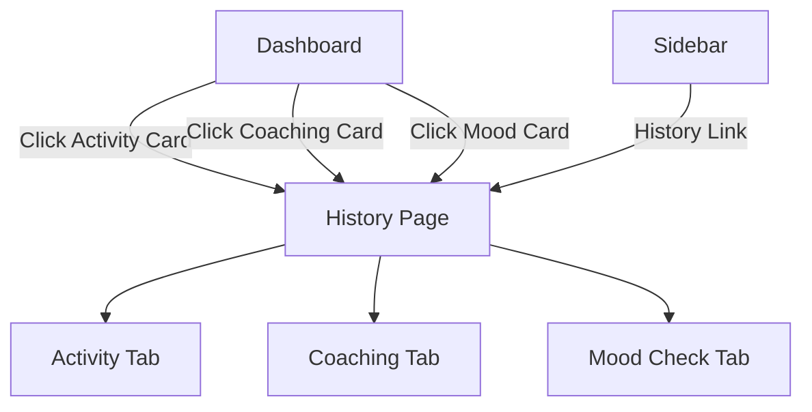

# Implementation Plan - Consolidate Activity, Coaching, and Mood Checks

This plan outlines the steps to merge the separate "Activity History", "Coaching Milestones", and "Language Mood Checks" (Mindset) into a single, cohesive navigation view.

## Goal Description
Currently, user progress and feedback are split across multiple pages:
- `/portal/activities`: Shows immersion activities.
- `/portal/check-in-history`: Shows mindset (mood) and coaching milestones.
- `/portal/coaching`: Placeholder page.

This change will consolidate these into one "History & Insights" page with three tabs for better user experience and easier navigation.

## User Description
A new "History" section will be created in the portal. It will contain three tabs:
1. **Activities**: View your daily immersion history and stats.
2. **Coaching**: Track your progress towards milestones and coaching sessions.
3. **Mood Checks**: Review your daily mindset and language learning sentiment history.

The sidebar will be updated to show a single "History" link instead of multiple separate links. Dashboard cards will also be updated to point to this new consolidated view.

## Proposed Changes

### [Component Name] Portal Layout & Navigation

#### [MODIFY] [portal-sidebar.tsx](file:///Users/alanglass/_dev_local/Learn%20Comp%20Input/LearnCI-web/components/portal-sidebar.tsx)
- Remove "Coaching" and "Activities" links.
- Add a new "History" link pointing to `/portal/history`.
- Use a suitable icon (e.g., `History` or `BarChart3`).

#### [MODIFY] [page.tsx](file:///Users/alanglass/_dev_local/Learn%20Comp%20Input/LearnCI-web/app/portal/page.tsx) (Dashboard)
- Update links in cards to point to the new `/portal/history` page.
- Optionally add hash or query params if we want to deep-link to specific tabs (e.g., `/portal/history?tab=coaching`).

### [Component Name] History View

#### [NEW] [page.tsx](file:///Users/alanglass/_dev_local/Learn%20Comp%20Input/LearnCI-web/app/portal/history/page.tsx)
- Create a server component that fetches:
    - `user_activities`
    - `daily_feedback` (Mindset)
    - `coaching_check_ins` (Milestones)
- Pass this data to a new client component `HistoryCombinedClient`.

#### [NEW] [HistoryCombinedClient.tsx](file:///Users/alanglass/_dev_local/Learn%20Comp%20Input/LearnCI-web/app/portal/history/HistoryCombinedClient.tsx)
- A client component using `Tabs` from `@/components/ui/tabs`.
- **Tab 1: Activity**: Integrates functionality from `ActivityHistoryClient`.
- **Tab 2: Coaching**: Renders the "Milestones" list logic currently in `check-in-history/page.tsx`.
- **Tab 3: Mood Checks**: Renders the "Mindset" list logic currently in `check-in-history/page.tsx`.
- Handle sheet/form states for logging new items (Activity, Mindset).

#### [DELETE] [page.tsx](file:///Users/alanglass/_dev_local/Learn%20Comp%20Input/LearnCI-web/app/portal/activities/page.tsx)
- Remove the old separate activities page.

#### [DELETE] [page.tsx](file:///Users/alanglass/_dev_local/Learn%20Comp%20Input/LearnCI-web/app/portal/check-in-history/page.tsx)
- Remove the old check-in history page.

#### [DELETE] [page.tsx](file:///Users/alanglass/_dev_local/Learn%20Comp%20Input/LearnCI-web/app/portal/coaching/page.tsx)
- Remove the placeholder coaching page.

## Verification Plan

### Automated Tests
- Run `npm run build` to ensure no broken imports or type errors.
- (If existing tests exist) Run relevant Vitest tests.

### Manual Verification
1. Navigate to the new `/portal/history` page via the sidebar.
2. Verify that all three tabs (Activity, Coaching, Mood Checks) load correct data.
3. Test switching between tabs.
4. Test "Log Activity" and "Log Mindset" from within their respective tabs.
5. Verify that dashboard cards correctly link to the new history page.
